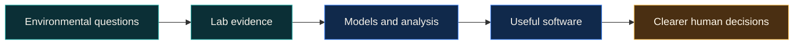

<table align="center" width="100%" cellpadding="0" cellspacing="0" border="0" bgcolor="#061B21">
  <tr>
    <td align="center" bgcolor="#061B21">
      
    </td>
  </tr>
  <tr>
    <td align="center" bgcolor="#061B21">
      <h1><font color="#F5F1E9">SOHEIL AGHAYANI</font></h1>

      <p><strong><font color="#F5F1E9">Environmental Engineer · Sustainability Researcher · Software Builder</font></strong></p>
      <p><font color="#B8E3DD">Research that becomes a system. Systems that feel human.</font></p>

      <p>
        <a href="https://soheil-aghayani.github.io/"><font color="#F8D58B"><strong>ENTER THE PORTFOLIO</strong></font></a>
        &nbsp; · &nbsp;
        <a href="https://soheil-aghayani.github.io/projects.html"><font color="#F8D58B"><strong>EXPLORE THE LAB</strong></font></a>
        &nbsp; · &nbsp;
        <a href="https://www.linkedin.com/in/agseyl/"><font color="#F8D58B"><strong>CONNECT</strong></font></a>
      </p>
    </td>
  </tr>
</table>

<br>

<table align="center">
  <tr>
    <td align="center" width="33%"><strong>01 · RESEARCH</strong><br><sub>Waste valorization · biofuel · LCA</sub></td>
    <td align="center" width="33%"><strong>02 · ENGINEERING</strong><br><sub>Data · automation · technical systems</sub></td>
    <td align="center" width="33%"><strong>03 · EXPERIENCES</strong><br><sub>Interfaces · games · creative tools</sub></td>
  </tr>
</table>

## The north star

I am an environmental engineer and sustainability researcher based in Tehran, Iran. My work lives at the intersection of **solid waste management, waste-to-value systems, biofuel production, life cycle assessment, data analysis, and software design**.

I care about the moment a complicated idea becomes clear: a researcher can make a better decision, a team can see the next step, or a person can open a small tool and immediately feel invited to explore.

```text
research question  →  evidence  →  useful system  →  human outcome
```

## Featured orbit

<table>
  <tr>
    <td width="50%">
      <h3><a href="https://soheil-aghayani.github.io/">Portfolio OS</a></h3>
      <p>A living portfolio with a terminal, research flowchart, publications, notes, games, and a small operating system of ideas.</p>
      <sub>HTML · CSS · JavaScript · Canvas</sub>
    </td>
    <td width="50%">
      <h3><a href="https://soheil-aghayani.github.io/Gamify-Garden/">Apricity · Gamify Garden</a></h3>
      <p>A gentle RTL productivity garden where tiny actions become visible growth, built with care and zero pressure.</p>
      <sub>React · TypeScript · PWA · Persian RTL</sub>
    </td>
  </tr>
  <tr>
    <td width="50%">
      <h3><a href="https://soheil-aghayani.github.io/Design-Suite/">Design Suite</a></h3>
      <p>A browser-based visual workshop for diagrams, gradients, typography, conversion, and practical creative utilities.</p>
      <sub>Vanilla JavaScript · SVG · Export workflows</sub>
    </td>
    <td width="50%">
      <h3><a href="https://soheil-aghayani.github.io/Coffpen/">Coffpen</a></h3>
      <p>A Persian writing space where coffee, short stories, editorial typography, and a quiet reading experience meet.</p>
      <sub>Static publishing · CMS · Persian typography</sub>
    </td>
  </tr>
  <tr>
    <td width="50%">
      <h3><a href="https://soheil-aghayani.github.io/pahlavan/">Pahlavan</a></h3>
      <p>An atmospheric 3D musical manuscript inspired by Persian mythology, epic storytelling, and deliberate interaction.</p>
      <sub>CSS 3D · Web Audio · visual storytelling</sub>
    </td>
    <td width="50%">
      <h3><a href="https://github.com/Soheil-Aghayani/x-clone">X Clone</a></h3>
      <p>A native JavaFX social client with a shared Java backend, authentication, feeds, conversations, and real persistence.</p>
      <sub>Java 21 · JavaFX · SQLite · Turso</sub>
    </td>
  </tr>
</table>

<details>
<summary><strong>More sparks from the constellation</strong></summary>

| Project | What it is |
| --- | --- |
| [IRISWA](https://soheil-aghayani.github.io/iriswa/) | Persian environmental publishing for waste-management knowledge, courses, and events |
| [NCBI Explainer](https://soheil-aghayani.github.io/ncbi/) | A visual path from a biological question to the right research database |
| [Laboratory Rules](https://soheil-aghayani.github.io/Laboratory-Rules/) | RTL safety, operating protocols, waste workflows, and emergency guidance |
| [Food Recipe](https://soheil-aghayani.github.io/food-recipe/) | A playful browser desktop where recipes, music, files, and tiny apps coexist |
| [Egg Timer](https://soheil-aghayani.github.io/egg-timer/) | A small, warm interface for choosing the egg you actually want |
| [Ashfall Embers Trial](https://github.com/Soheil-Aghayani/dodge-game) | A PyQt5 survival arcade experiment about movement, pressure, and falling hazards |

</details>

## The through-line



## Research signal

- Solid waste management and waste valorization
- Biofuel production using waste-derived catalysts
- Life cycle assessment with **SimaPro** and **OpenLCA**
- Landfill gas modelling and biomass resource assessment
- Circular economy systems that can move from paper to practice

## Build signal

| Layer | Tools I reach for |
| --- | --- |
| Analysis | Python, data processing, automation, scientific workflows |
| Web | JavaScript, TypeScript, HTML, CSS, Canvas, SVG |
| Desktop | C#, WPF, Java, JavaFX |
| Research | SimaPro, OpenLCA, LandGEM, GIS, technical communication |

<details>
<summary><strong>How to explore this account</strong></summary>

Start with the [portfolio](https://soheil-aghayani.github.io/) for the full story, open [Projects](https://soheil-aghayani.github.io/projects.html) for the visual catalogue, then dive into the repository that catches your eye. The small projects are experiments; the research work is the compass; the interface is the invitation.

</details>

## Find me

<div align="center">
  <a href="https://soheil-aghayani.github.io/">Portfolio</a>
  &nbsp; · &nbsp;
  <a href="https://soheil-aghayani.github.io/projects.html">Projects</a>
  &nbsp; · &nbsp;
  <a href="https://www.linkedin.com/in/agseyl/">LinkedIn</a>
  &nbsp; · &nbsp;
  <a href="mailto:soheyl.aghayani@gmail.com">Email</a>
  <br><br>
  <sub>Researcher · Engineer · Builder</sub>
</div>
